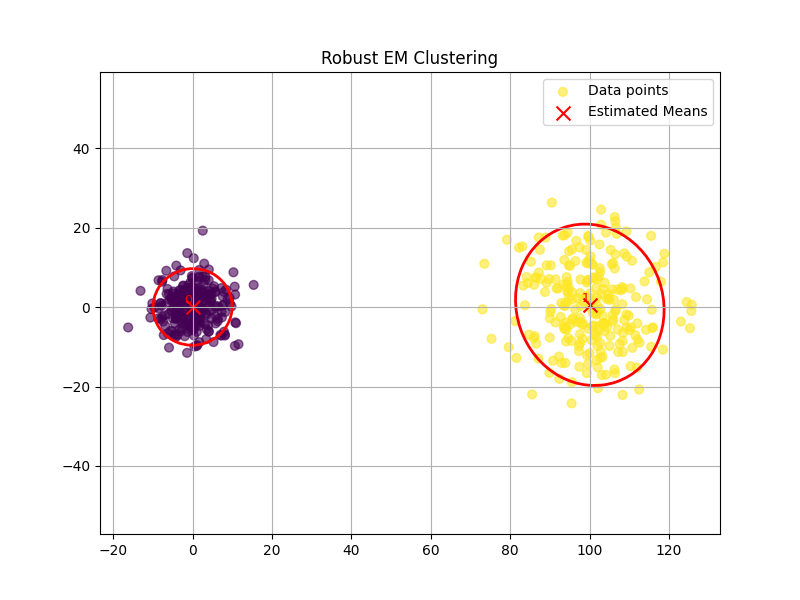

# STAT 440 Final Project

This project contains the implementation of the standard Expectation-Maximization (`EM`) algorithm as well as an algorithm presented in [1] which we refer to as `robustEM`. 

## Gaussian Mixture Models

Suppose we have a dataset $X$ of $n$ points, each of which has dimension $d$ i.e, $X \subset \mathbb{R}^d$. We want to cluster i.e, partition $X$ into $c$ clusters. The points are assumed to be generated from the following density function : 

$$ f(x) = \sum_{k=1}^c \alpha_k f_k(x ; \mu_k,\Sigma_k) $$

where $f$ is the multivariate normal distribution. 

## Algorithm API

- Standard EM 

```
 def EM(X, c, eps=1e-4, maxIter=100):
 """
    Perform the EM algorithm on a dataset X for Gaussian Mixture Models.

    Parameters:
    X : numpy.ndarray of shape (n, d) - input data
    c : int - number of clusters
    eps : float - convergence threshold
    maxIter : int - maximum number of iterations

    Returns:
    alpha : mixture weights
    mu : means of Gaussians
    sigma : covariances of Gaussians
    z : responsibilities (c x n matrix)
    """
```

- Robust EM computes the appropriate number of clusters automatically

```
def robustEM(X, eps = 1e-4, maxIter = 100) : 
    """
    Perform the robust EM algorithm on a dataset X for Gaussian Mixture Models.

    Parameters:
    X : numpy.ndarray of shape (n, d) - input data
    eps : float - convergence threshold 

    Returns:
    alpha : mixture weights
    mu : means of Gaussians
    sigma : covariances of Gaussians
    z : responsibilities (c x n matrix)
"""
```


## Example Usage

Example usage can be found in 'synthetic.py'



## References 

[1] Miin-Shen Yang, Chien-Yo Lai, Chih-Ying Lin, A robust EM clustering algorithm for Gaussian mixture models Pattern Recognition, Volume 45, Issue 11,
2012. 